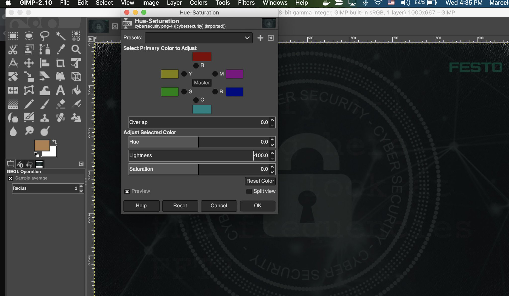
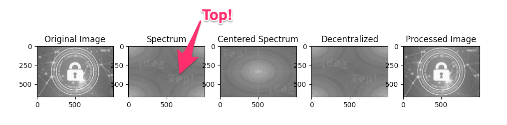

# How to solve this challenge

Mystery Man says: "The code is hidden in the image on the page that does not exist."

So if we deliberately navigate to an invalid URL context (HTTP 404 = Page Not Found), e.g., [https://coding-challenge.festo.com/blablabla](https://coding-challenge.festo.com/blablabla), we will find a background image referenced in the page's CSS code (`cybersecurity.png`).

Use some Image Editing software to adjust the Brightness / Colors of the image to reveal a watermark text.



The text says:

> "Nice try"
> "Nothing here"
> "Have a look at the frequencies"
> "FFT?"

# FFT (Fast Fourier transform)

Straight from Wikipedia: A fast Fourier transform (FFT) is an algorithm that computes the discrete Fourier transform (DFT) of a sequence, or its inverse (IDFT). Fourier analysis converts a signal from its original domain (often time or space) to a representation in the frequency domain and vice versa.

The following Python code will reveal the secret text hidden in the image:

```
import cv2
import numpy as np
import matplotlib.pyplot as plt

plt.figure(figsize=(6.4*5, 4.8*5), constrained_layout=False)

img_c1 = cv2.imread("cybersecurity.png", 0)
img_c2 = np.fft.fft2(img_c1)
img_c3 = np.fft.fftshift(img_c2)
img_c4 = np.fft.ifftshift(img_c3)
img_c5 = np.fft.ifft2(img_c4)

plt.subplot(151), plt.imshow(img_c1, "gray"), plt.title("Original Image")
plt.subplot(152), plt.imshow(np.log(1+np.abs(img_c2)), "gray"), plt.title("Spectrum")
plt.subplot(153), plt.imshow(np.log(1+np.abs(img_c3)), "gray"), plt.title("Centered Spectrum")
plt.subplot(154), plt.imshow(np.log(1+np.abs(img_c4)), "gray"), plt.title("Decentralized")
plt.subplot(155), plt.imshow(np.abs(img_c5), "gray"), plt.title("Processed Image")

plt.show()
```

BTW, you will need to install a couple of libs:
```
 python -m pip install cv2
 python -m pip install opencv-python
```

# The solution

The fft plotting will reveal the following text: "Top!".
Here's a screenshot:



Kudos to [this article](https://hicraigchen.medium.com/digital-image-processing-using-fourier-transform-in-python-bcb49424fd82).
